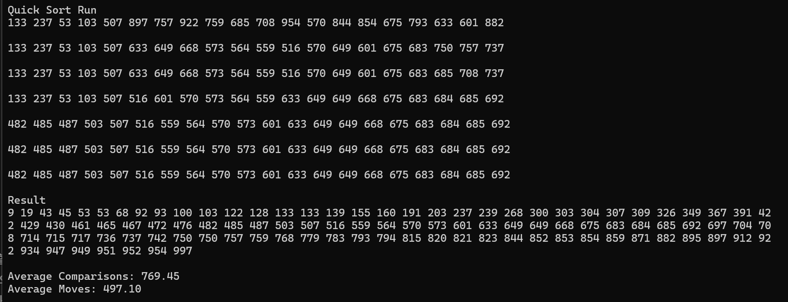

#bonus quicksort {Result Image}
정렬방법(선택, 삽입, 버블, 쉘, 합병)과 성능 비교 설명: 
퀵 정렬은 분할 정복을 통해 평균적으로 O(nlogn)의 시간 복잡도를 가지며, 선택, 삽입, 버블, 쉘 정렬의 평균/최선 복잡도인 O(n²)보다 유리하다. 
합병 정렬은 O(nlogn)의 시간 복잡도를 가짐으로 비교하면 퀵 정렬과 시간 복잡도는 동일하지만, 퀵 정렬은 제자리 정렬이 가능해 공간적 측면에서 더 유리하고 퀵 정렬 과정에서 한번에 이동하는 데이터가 더 많아 시간적 부분에서도 유리하다.

