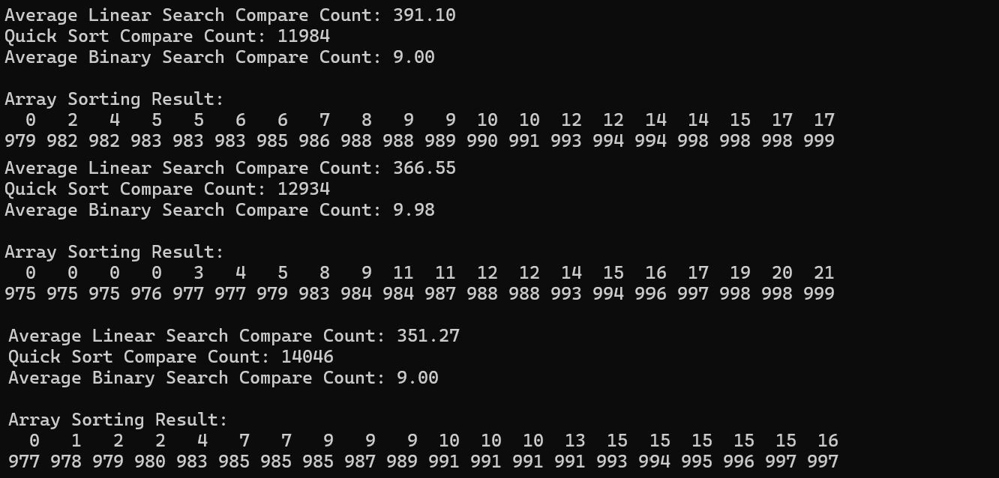

#15-compareSearches{Result Image}
퀵 정렬 후 이진 탐색이 순차 탐색보다 비교 횟수가 적은 이유:
순차 탐색은 배열의 첫 번째 요소부터 마지막 요소까지 순서대로 비교하기 때문에 시간복잡도가 O(n)이다. 반면, 이진 탐색은 정렬된 데이터를 기준으로 중간값을 선택해 검색 범위를 절반으로 줄여나가기 때문에 시간복잡도가 O(log n)로 더 효율적이다. 이로 인해 이진 탐색의 비교 횟수는 순차 탐색보다 적다. 다만, 이진 탐색을 사용하려면 데이터를 미리 정렬해야 한다. 여기서 퀵 정렬을 사용한다면, 평균 시간복잡도가 O(n log n)로 순차 탐색보다 더 많은 비교를 필요로 한다. 이 때문에 정렬 과정까지 포함하면 이진 탐색의 총 비교 횟수가 순차 탐색보다 많아질 것처럼 보일 수 있다. 그러나 정렬은 데이터 전체에 대해 한 번만 수행한다. 이후 동일한 데이터에서 여러 번 탐색을 진행할 경우, 정렬 횟수는 변하지 않고 이진 탐색의 비교횟수만 변동된다. 따라서 여러 번 탐색이 필요한 상황에서는 퀵 정렬 후 이진 탐색이 훨씬 유리하다.

