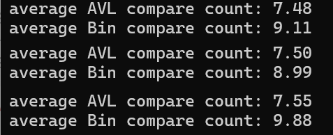

1. 이진 탐색 트리(BST) 탐색
이진 탐색 트리에서 탐색의 비교 횟수는 트리의 높이에 비례한다. 최악의 경우(트리가 한쪽으로 치우친 경우) O(n)의 성능을 보여주고 평균적인 경우 O(logn)의 성능을 보여준다.
2. AVL 트리 탐색
AVL 트리는 자기 균형 이진 탐색 트리로, 모든 노드에서 왼쪽과 오른쪽 서브트리의 높이 차가 최대 1로 유지된다. 그러므로 AVL 트리의 높이는 항상 O(logn)의 성능을 보여준다.
3. 코드 실행결과
해당 코드에서 출력한 AVL와 이진탐색 트리의 평균비교횟수는 약 2회 정도 차이가 난다. AVL트리 탐색이 이진 탐색 트리보다 더 적은 양의 비교를 하는 것으로 나타났는데 이로 AVL트리 탐색이 이진탐색 트리보다 유리하다는 것을 알 수 있다. 
4. 실행결과의 이유
이진탐색트리는 삽입 순서에 따라 성능이 변동하여 O(logn)의 성능을 보장하지 못 한다. 하지만 AVL트리는 삽입과 삭제 시 항상 균형을 유지하기 때문에 삽입 순서에 따른 성능 변동이 없다. 그러므로 AVL은 O(logn)의 성능을 항상 유지한다. 

#17-compareAVL{Result Image}

